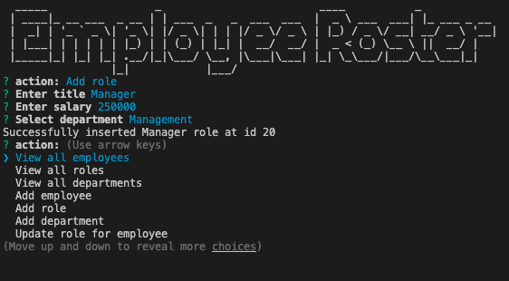
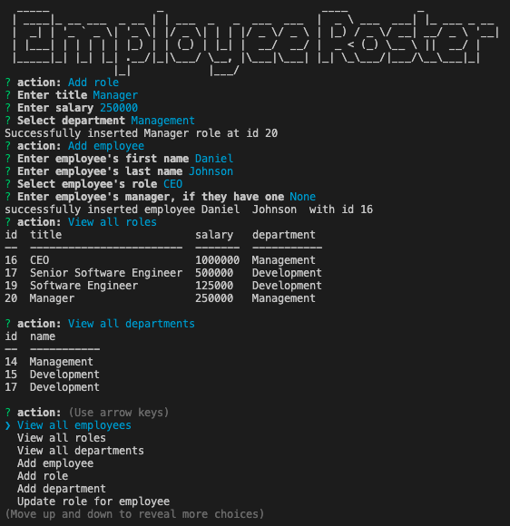

# CLI-Content-Management-System
A command line interface application which manages a company's employee database using Node.js, Inquirer and MySQL. 

## Video Walk-Through 
[Here](https://drive.google.com/file/d/1xNW0-iYvIcTp6PT_sMkXXZ9lKlKgY1GW/view)

## Installation
- To install, clone this repository to your local device by entering the following command in your CLI:
```bash
git clone git@github.com:oconnorjohnson/CLI-Content-Management-System.git
```
- Open the repository in VS Code and the .sql files located in cli-content-management-system/db in MySQL. Within your terminal, run:
```bash
npm install
``` 
- Within VS Code, change the password in server.js under 
```javascript
const connection
```
- Create schema of database tables running all queries in ```schema.sql```
- Run queries in ```seed.sql``` or set up test records yourself

## Usage 
Use this content management system to track your employees along with their departments, roles, salary and more. To run the program, enter:
```bash 
node server
```
into the command line after following installation instructions. 

To avoid errors when ENTERING data, ALWAYS enter your company's data in the following order: 
1. Add departments before roles.  
2. Add roles before employees. 
To add a role, the corresponding department must already exist. 
To add an employee, the corresponding role must already exist.

To avoid errors when DELETING data, ALWAYS delete your company's data in the following order: 
1. Delete employees before roles. 
2. Delete roles before departments.
To delete a department, the corresponding roles must first be deleted. 
To delete a role, all corresponding employees must first be deleted. 

  </img>
  </img>
  </img>
  </img>

## License 
[](https://www.gnu.org/licenses/gpl-3.0)

## Lessons 
Although it was a literal practice in Node.js and MySQL, this project served as an excellent roundabout practice in debugging. The detailed-nature of MySQL syntax compared to the looser structure of Node led to several syntax errors that produced a host of bugs which took a few hours to work through. Having completed a CLI-CMS I am far more confident in my Node and MySQL skills. 
